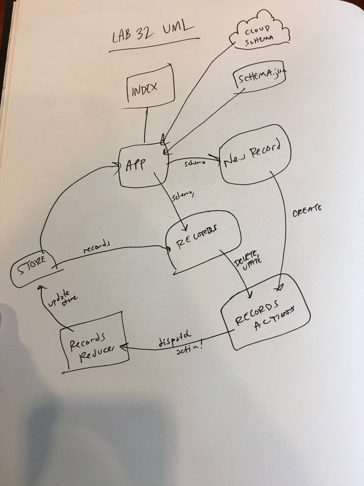

 LAB
=================================================

## Lab 32: Dynamic Forms

### Author: Joseph Wolfe

### Links and Resources
* [GitHub](https://github.com/charmedsatyr-401-advanced-javascript/lab-32)
* [](https://travis-ci.com/charmedsatyr-401-advanced-javascript/lab-32) 

### Modules
```
.
├── LICENSE
├── package.json
├── public
│   ├── favicon.ico
│   ├── index.html
│   └── manifest.json
├── README.md
├── src
│   ├── App.js
│   ├── index.js
│   ├── Numbers.js
│   ├── serviceWorker.js
│   ├── store
│   │   ├── app-actions.js
│   │   ├── app-reducers.js
│   │   ├── index.js
│   │   ├── middleware
│   │   │   └── reporter.js
│   │   ├── numbers-actions.js
│   │   └── numbers-reducer.js
│   └── style.scss
└── yarn.lock

4 directories, 18 files
```

---

### `./public/*`
#### Exported Values and Methods
Static views provided by `create-react-app`.

---

### `./src/index.js`
#### Exported Values and Methods
Entry point that renders `<App/>` wrapped in a store `<Provider/>` component.

---

### `./src/App.js`
#### Exported Values and Methods
Contains application state and methods and renders `<Numbers/>` as a child.

---

### `./src/store/app-actions.js`
#### Exported Values and Methods
`nameChanger(payload)` -> Action creator, returns `Object` with type `CHANGE`.

---


### `./src/store/numbers-actions.js`
#### Exported Values and Methods
`change()` -> Action creator, returns `Object` with type `CHANGE`.
`reset()` -> Action creator, returns `Object` with type `RESET`.

---
### `./src/store/app-reducers.js`
#### Exported Values and Methods
Reducer to modify `app` state.

---

### `./src/store/numbers-reducer.js`
#### Exported Values and Methods
Reducer to modify `numbers` state.

---

#### Tests
* What assertions were made?
  * N/A

* What assertions need to be / should be made?
  * Snapshot and functional tests could be made for each component.
  * Tests could ensure each component properly calls `dispatch` with internal handlers.
  * Action creators and reducers could be tested to ensure appropriate output.

#### UML

